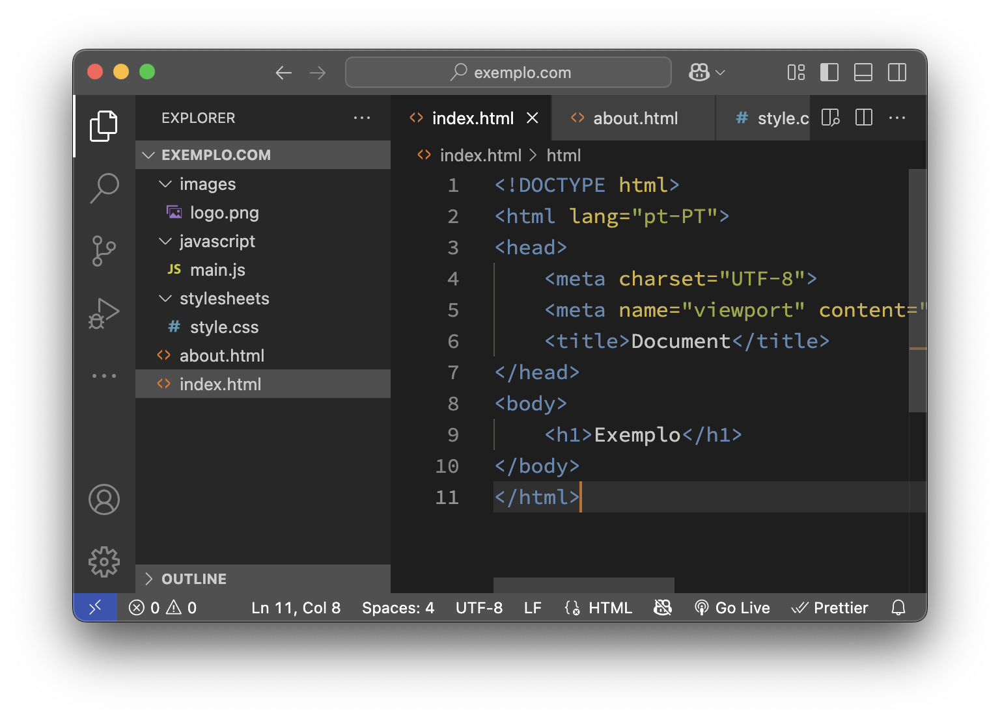

# Estrutura de um Website

O que é um website?

Um website é um conjunto de páginas web interligadas, acessíveis através da internet, que podem conter texto, imagens, vídeos e outros tipos de conteúdo. 

Cada página é escrita em HTML (HyperText Markup Language), pode ser estilizada com CSS (Cascading Style Sheets) para melhorar a apresentação visual, e pode incluir interatividade através de JavaScript. 

As páginas web podem ainda incluir elementos multimédia, como vídeos e áudio.

## Boas práticas na estrutura de um website

Embora estas três tecnologias possam ser codificadas todas no mesmo ficheiro (por exemplo num pequeno tutorial, ou pequena ilustração), é uma boa prática separá-las em ficheiros distintos para facilitar a manutenção e a legibilidade do código, principalmente em projetos maiores. 

Para além disso a separação de ficheiros permite que diferentes pessoas trabalhem em diferentes partes do projeto sem conflitos, e também possibilita a reutilização de código em diferentes páginas ou até diferentes projetos.

Assim é normal organizar um website em três tipos de ficheiros, colocando-os em pastas distintas:

- **HTML**: Os ficheiros com a extensão `.html` que contêm a estrutura e o conteúdo das páginas web devem ser colocados na raiz do projeto ou subpastas específicas conforme a organização do site.
- **CSS**: Ficheiros com a extensão `.css` que definem o estilo e a apresentação visual das páginas devem ser colocados numa pasta chamada `css`, `stylesheets` ou `styles`, para manter a organização e facilitar a manutenção do código.
- **JavaScript**: Ficheiros com a extensão `.js` que adicionam interatividade e funcionalidades dinâmicas às páginas web devem ser colocados numa pasta chamada `js`, `scripts` ou `javascript`.


## Estrutura típica de um website

Um estrutura típica de um website pode ser organizada da seguinte forma:

```website/
├── index.html
├── about.html
├── contact.html
├── stylesheets/
│   ├── styles.css
│   └── responsive.css
├── javascripts/
│   ├── main.js
│   └── utils.js
└── images/
    ├── logo.png
    └── banner.jpg
```

O ponto de entrada principal do website é geralmente o ficheiro `index.html`, que é carregado por defeito quando se acede ao domínio do site. Por exemplo, se o website estiver hospedado em `www.exemplo.com`, o servidor irá automaticamente procurar por `index.html` na raiz do projeto. 

Por vezes certos servidores web podem ter configurações diferentes utilizando `default.html`, ou `Iisstart.htm`, mas `index.html` é o padrão mais comum e deve ser o vosso ponto de partida ao criar um website.




Os editores de código modernos, como Visual Studio Code, permitem criar e organizar facilmente os ficheiros e pastas do projeto. Normalmente possuem uma interface gráfica que mostra a árvore da pasta onde se situa o projeto o que facilita a criação de novas pastas e ficheiros, bem como a navegação entre eles. 