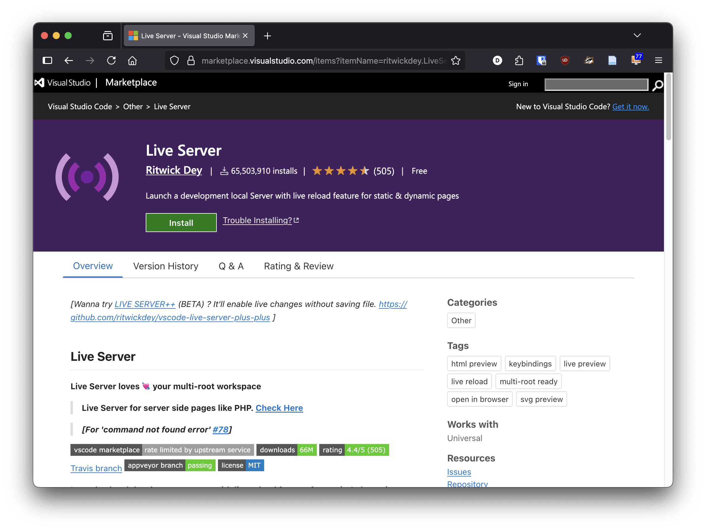

# Ferramentas e Ambientes de Desenvolvimento
 
- [Ferramentas e Ambientes de Desenvolvimento](#ferramentas-e-ambientes-de-desenvolvimento)
  - [Editores de Código](#editores-de-código)
  - [Browser Moderno](#browser-moderno)
    - [Browser Mobile](#browser-mobile)
  - [Ferramentas de Desenvolvimento (DevTools)](#ferramentas-de-desenvolvimento-devtools)
  - [Servidor Web Local](#servidor-web-local)

Neste capítulo, vamos explorar as ferramentas e ambientes de desenvolvimento mais comuns usados na criação de websites. Estas ferramentas ajudam os autores a escrever, testar e depurar o código de forma eficiente e rápida. Uma boa configuração de ambiente é essencial para o sucesso de qualquer projeto web.
 
## Editores de Código
 
Os editores de código são ferramentas essenciais para escrever e editar código-fonte. Alguns dos editores mais populares incluem:
 
- **[Visual Studio Code](https://code.visualstudio.com/)**: Um editor leve e extensível com suporte a várias linguagens de programação.
- **[Sublime Text](https://www.sublimetext.com/)**: Um editor rápido e poderoso com uma interface minimalista.
- **[Notepad](https://notepad-plus-plus.org/)++**: Um editor simples e eficaz para Windows.
- ... outros editors de código como Atom, Brackets, etc.

> A recomendação é usar o **Visual Studio Code**, pois é amplamente adotado e possui uma vasta gama de extensões que facilitam o desenvolvimento web. Embora os exemplos apresentados neste curso sejam feitos no Visual Studio Code, os conceitos são aplicáveis a qualquer editor de código.

## Browser Moderno

É importante usar um browser moderno para testar e depurar websites. Os browsers mais comuns incluem:

- **[Google Chrome](https://www.google.com/chrome/)**: Um dos browsers mais populares, com excelentes ferramentas de desenvolvimento integradas.
- **[Mozilla Firefox](https://www.mozilla.org/firefox/)**: Outro browser popular, conhecido por sua privacidade e extensões.
- **[Microsoft Edge](https://www.microsoft.com/edge)**: O browser padrão do Windows, baseado no Chromium.
- **[Safari](https://www.apple.com/safari/)**: O browser padrão do macOS e iOS, com bom suporte a padrões web.

> A recomendação é usar o **Google Chrome** ou o **Mozilla Firefox**, pois ambos possuem ferramentas de desenvolvimento robustas que facilitam a depuração e o teste de websites.

### Browser Mobile

Para testar a responsividade e o comportamento de websites em dispositivos móveis, é importante também usar um browser móvel. Os browsers móveis mais comuns incluem:

- **[Google Chrome para Android](https://play.google.com/store/apps/details?id=com.android.chrome)**: Versão móvel do Chrome, com suporte a ferramentas de desenvolvimento.
- **[Mozilla Firefox para Android](https://play.google.com/store/apps/details?id=org.mozilla.firefox)**: Versão móvel do Firefox, com suporte a extensões e ferramentas de desenvolvimento.
- **[Safari para iOS](https://www.apple.com/safari/)**: O browser padrão do iOS, com suporte a ferramentas de desenvolvimento.
- **[Microsoft Edge para Android](https://play.google.com/store/apps/details?id=com.microsoft.emmx)**: Versão móvel do Edge, com suporte a sincronização e ferramentas de desenvolvimento.

## Ferramentas de Desenvolvimento (DevTools)

É importante também instalar as **Ferramentas de Desenvolvimento** (DevTools) do browser, que permitem inspecionar o código HTML, CSS e JavaScript, depurar erros e otimizar o desempenho do site. Estas ferramentas estão disponíveis em todos os browsers modernos.

Para abrir as DevTools, geralmente pode-se usar a tecla `F12` ou clicar com o botão direito do mouse na página e selecionar “Inspecionar” ou “Inspecionar Elemento”.

No caso do Safari é necessário ativar as ferramentas de desenvolvimento nas preferências do browser. Vá a “Preferências” > “Avançado” e marque a opção “Mostrar menu Develop na barra de menus” ou “Show features for web developers”. Depois disso, você pode aceder as DevTools através do menu “Develop”.

## Servidor Web Local

Para testar websites localmente, é útil configurar um servidor web local. Isso permite simular o ambiente de produção e testar recursos como requisições HTTP, APIs e interações com o servidor.

A melhor forma de correr um servidor web local para testar o seu website é usar o **[Live Server](https://marketplace.visualstudio.com/items?itemName=ritwickdey.LiveServer)**, uma extensão do Visual Studio Code que permite iniciar um servidor local com um clique. 

Para instalar, basta procurar por “Live Server” na loja de extensões do Visual Studio Code e clicar em “Instalar”. Depois de instalado, pode iniciar o servidor clicando com o botão direito do rato no ficheiro HTML e selecionando “Open with Live Server”.

