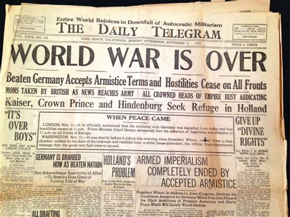
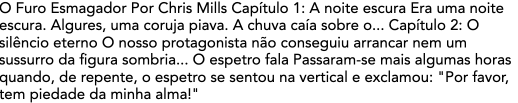
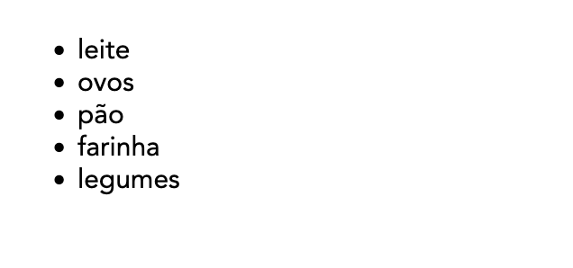
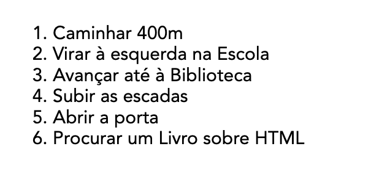
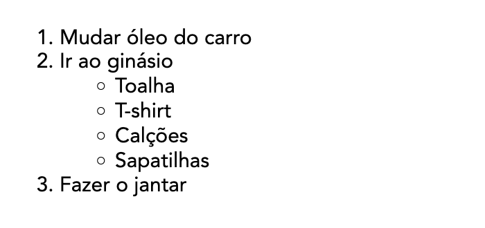
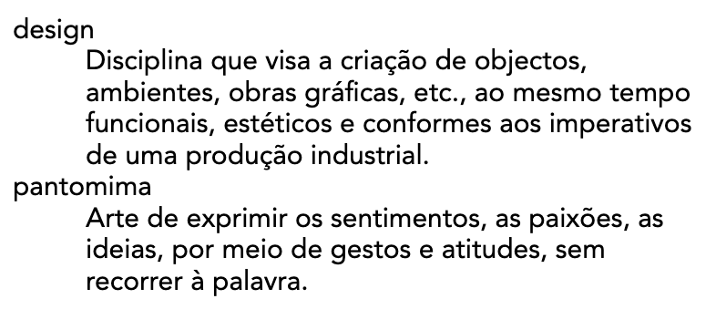

# Elementos HTML para o Body

<style>
    img {
        padding: 2px;
        background: #999;
    }
</style>

O objetivo do HTML é estruturar o documento que vai ser mostrado ao utilizador.
Vamos explorar aqui os principais elementos disponíveis para estruturar diferentes tipos de informação.

- [Elementos HTML para o Body](#elementos-html-para-o-body)
  - [Cabeçalhos e parágrafos](#cabeçalhos-e-parágrafos)
    - [Parágrafos](#parágrafos)
    - [Cabeçalhos](#cabeçalhos)
      - [Implementando uma hierarquia](#implementando-uma-hierarquia)
    - [Porque é importante a estrutura?](#porque-é-importante-a-estrutura)
  - [Porque é importante a semântica?](#porque-é-importante-a-semântica)
  - [Hiperligações e navegação](#hiperligações-e-navegação)
    - [Anatomia de uma hiperligação](#anatomia-de-uma-hiperligação)
    - [Hiperligações de outros elementos HTML](#hiperligações-de-outros-elementos-html)
    - [Hiperligações de imagens](#hiperligações-de-imagens)
    - [Atributos extra das hiperligações](#atributos-extra-das-hiperligações)
    - [Hiperligações e caminhos de ficheiros](#hiperligações-e-caminhos-de-ficheiros)
    - [Hiperligações para fragmentos do documento](#hiperligações-para-fragmentos-do-documento)
    - [Melhores práticas](#melhores-práticas)
  - [Listas](#listas)
  - [Listas hierarquicas](#listas-hierarquicas)
  - [Listas de definições](#listas-de-definições)
  - [Exercício prático](#exercício-prático)

## Cabeçalhos e parágrafos



a Maioria do texto estruturado consiste em cabeçalhos e parágrafos, seja em livros, jornais ou revistas entre outros. Esta estruturação dos conteúdos facilita a legibilidade e a transmissão da mensagem.

### Parágrafos

Em HTML, cada parágrafo é definido pelo elemento HTML `<p>`. Por exemplo:

```html
<!-- O parágrafo é o principal elemento para 
     estruturar o corpo de texto -->
<p>A Escola conta com cerca de 1600 alunos e 130 professores</p>
```

Os textos dos parágrafos podem ainda conter palavras ou partes que sejam de particular importância. Desde o início que o HTML inclui alguns elementos que permitem destacar partes de uma frase. Por exemplo para dar enfase podemos utilizar a tag `<em>` (de _empahsis_). Por exemplo:

```html
<p>— Ontem estavas bem <em>acompanhado</em></p>
```


Os browsers normalmente renderizam o elemento `<em>` como itálico, embora o objetivo não deva ser apenas de o estilizar como itálico, uma vez que os dispositivos de leitura assistida vão interpretar o elemento de outra forma, por exemplo mudando o tom de voz.

Também está disponível a tag `<strong>` quando queremos destacar uma palavra.

```html
<p>— <strong>Não</strong> te vou dizer nada</p>
```


Neste caso a palavra **Não** foi destacada pelo browser com negrito.

Quer o elemento `<em>` quer o `<strong>` tem significado semântico definido e são interpretados pelos diferentes dispositivos de leitura de acordo. No entanto há alguns elementos mais antigos que não são tão claros quanto ao seu valor semântico.

Os elementos `<b>, <i> e <u>` originalmente foram implementados para dar estilos de itálico, negrito e sublinhado numa altura em que os estilos CSS não existiam. Assim acabaram por ser só elementos HTML de apresentação sem possuirem associados um valor semântico. Devem ser evitados em favor de `<em>` e `<strong>`.

Quanto à utilização do sublinhado convém notar que na Web o sublinhado é entendido como uma hiperligação, pelo que quando for necessário utilizar uma marca que cumpra o papel do sublinhado, pondere substituí-lo por outro elemento como por exemplo `<mark>` ou então redefinir o estilo em CSS para não incluir o sublinhado que se possa confundir com a hiperligação.

### Cabeçalhos

Os cabeçalhos permitem destacar os títulos, dando destaque a diversas mensagens. O HTML fornece 6 níveis de cabeçalhos. Os elementos HTML para definir cada um desses níveis são `<h1>, <h2>, <h3>, <h4>, <h5>, <h6>`. Por exemplo:

```html
<!-- Título de nível de importância mais elevado -->
<h1>ESADcr - Escola de artes e design</h1>
```

#### Implementando uma hierarquia

Dadas as importâncias relativas de cada tipo de elemento HTML é normal (e importante) estruturar o documento de forma hierarquica de forma a que a estrutura seja portadora de sentido semântico.

Assim é normal definir para cada página um título principal `<h1>` que representa o título da página[^h1], sendo que o nível `<h2>` é utilizado para o título de cada secção/capítulo, e o elemento `<h3>` representa normalmente as subsecções do documento.

Um pequeno exemplo da utilização de cabeçalhos com parágrafos:

```html
<h1>O Furo Esmagador</h1>

<p>Por Chris Mills</p>

<h2>Capítulo 1: A noite escura</h2>

<p>
 Era uma noite escura. Algures, uma coruja piava. 
 A chuva caía sobre o...</p>

<h2>Capítulo 2: O silêncio eterno</h2>

<p>O nosso protagonista não conseguiu arrancar 
    nem um sussurro da figura sombria...</p>

<h3>O espetro fala</h3>

<p>
 Passaram-se mais algumas horas quando, de repente, 
 o espetro se sentou na vertical e exclamou: 
 "Por favor, tem piedade da minha alma!"
</p>
```

O resultado pode ser observado online no exemplo de [Cabeçalhos e Parágrafos][lp1] e na figura seguinte:


### Porque é importante a estrutura?

Há várias razões para que um documento HTML tem uma estrutura hierarquizada:

- Os utilizadores ao abrir uma página tendem a fazer uma observação rápida para encontrar pontes de referência visual, ou para ler apenas os cabeçalhos. O tempo que cada utilizador gasta a ler uma página é muito reduzido, pelo a estrutura tem que ajudar o utilizador a obter a informação importante.
- Os motores de pesquisa indexam a página e tem em consideração os conteúdos dos cabeçalhos para definir a importância de palavras-chave. Sem cabeçalhos a página vai ser incapaz de ficar bem classificada nos resultados dos motores de pesquisa.
- Utilizadores com dificuldades visuais (amblíopes) normalmente não leem a página, mas antes ouvem uma leitura sintetizada por um [leitor de ecrã][screen_reader]. Uma das características deste tipo de software é que fornecem ao utilizador um sistema de navegação baseado nos cabeçalhos. Se os cabeçalhos não existirem isto obriga o utilizador a ouvir a totalidade do documento até encontrar o que procura.

No exemplo anterior, se retirassemos toda a estrutura (retirar os elementos HTML), o resultado não representaria a intenção original do autor.

```html
O Furo Esmagador

Por Chris Mills

Capítulo 1: A noite escura


 Era uma noite escura. Algures, uma coruja piava. 
 A chuva caía sobre o...

Capítulo 2: O silêncio eterno

O nosso protagonista não conseguiu arrancar 
    nem um sussurro da figura sombria...

O espetro fala


 Passaram-se mais algumas horas quando, de repente, 
 o espetro se sentou na vertical e exclamou: 
 "Por favor, tem piedade da minha alma!"
```



## Porque é importante a semântica?

> **Semântica**: Parte da linguística que estuda o significado das palavras. Que está relacionado com o significado dos objetos ou termos.

Nos dia a dia a semântica está em toda a parte—Utilizamos a nossa experiência para saber qual a função de cada objeto que encontramos; Quando vemos algo sabemos qual a sua função. Uma luz vermelha num semáforo significa "PARAR" e verde significa "AVANÇAR". Se a conexão semântica entre objeto e significado não existisse podem imaginar o caos que seria atravessar uma rua.

Da mesma forma, no HTML diferentes elementos HTML possuem valores semânticas—vimos o caso do parágrafo e dos cabeçalhos. Os browsers normalmente atribuem valores semânticos a estes elemento, renderizando por exemplo o `<h1>` como um tamanho maior que o `<h2>` e assim sucessivamente.

Também há elementos sem valor semântico. Por exemplo o elemento HTML `<span>` serve apenas para circunscrever conteúdos para posterior estilização com CSS, não tendo em si mesmo nenhum significado particular.

## Hiperligações e navegação

A invenção da hiperligação permitiu que a Web fosse mais do que um conjunto de documentos isolados, mas antes um sistema de páginas interconetadas por ligações entre si. A ideia de uma hiperligação é a de que um documento pode ter uma âncora que permite ao utilizador visitar outras páginas, recursos ou outras partes do mesmo documento, bastando clicar nessa pequena âncora. Qualquer conteúdo web pode ser convertido numa hiperligação através da atribuição de um URL (Uniform Resource Locator).

### Anatomia de uma hiperligação

A hiperligação é criada circunscrevendo o texto ou outro conteúdo dentro do elemento `<a>` (Âncora). O elemento âncora necessita ainda de saber qual o URL para onde deve apontar, pelo que é necessário incluir o atributo `href`. Por exemplo:

```html
<p>Este parágrafo contém uma ligação 
    para a <a href="https://www.ipleiria.pt/esadcr/">ESAD</a></p>
```

### Hiperligações de outros elementos HTML

No exemplo a palavra ESAD foi transformada numa hiperligação. No entanto quase todos os tipos de conteudos podem ser convertidos numa hiperligação. Por exemplo se quisermos converter o cabeçalho de uma página numa hiperligação podemos circunscrevê-lo com o elemento `<a>`:

```html
<a href="https://ead.ipleiria.pt/"> 
    <h1>Moodle do Laboratório Web</h1>
</a>
<p>Página da disciplina de Laboratório Web 
    onde ficam os materiais de estudo</p>
```


### Hiperligações de imagens

É possível transformar uma imagem numa hiperligação circunscrevendo o elemento `` com o elemento `<a>`.

```html
<a href="https://www.ipleiria.pt/esadcr/">
  
</a>
```

### Atributos extra das hiperligações

Para além do atributo **href** que indica à âncora qual o URL para o qual vai apontar, é importante também definir o atributo **title** que descreve o URL de destino. Para além disso os Browsers mostram esta descrição quando o rato é parado por algum tempo em cima da hiperligação[^a]:

```html
<a href="https://www.ipleiria.pt/esadcr/" 
   title="A melhor escola de Design do país">ESAD.cr</a>
```


O elemento âncora permite definir a janela onde a hiperligação vai surgir. Para que a hiperligação apareça numa nova janela deve-se utilizar o atributo **target** com a propriedade **_blank**

```html
<a href="https://www.ipleiria.pt/esadcr/" 
   title="A melhor escola de Design do país"
   target="_blank">ESAD.cr</a>
```

### Hiperligações e caminhos de ficheiros

Os URLs das âncoras utilizam o texto do atributo **href** para determinar que ficheiro enviar ao utilizador. Estas páginas podem estar em diferentes pastas do servidor.

Por exemplo, a página `contactos.html` será procurada na mesma pasta da página que contém o link seguinte.

```html
<a href="contactos.html">Contactos</a>
```

No exemplo seguinte, a página `contactos.html` será procurada numa subpasta `pessoas` em relação à página que contém o link seguinte.

```html
<a href="pessoas/contactos.html">Contactos</a>
```

No exemplo seguinte, a página `contactos.html` será procurada numa pasta pai em relação à página que contém o link seguinte.

```html
<a href="../contactos.html">Contactos</a>
```

No exemplo seguinte, a página `contactos.html` será procurada na raiz do website e é independente da subpasta que contém o link seguinte.

```html
<a href="/contactos.html">Contactos</a>
```

Em sumário:

```html
<a href="contactos.html">Contactos</a> <!-- mesma pasta -->
<a href="pessoas/contactos.html">Contactos</a> <!-- numa subpasta -->
<a href="../contactos.html">Contactos</a> <!-- numa pasta pai -->
<a href="/contactos.html">Contactos</a> <!-- na raiz do website -->
```

### Hiperligações para fragmentos do documento

As âncoras permitem também criar ligações para fragmentos dentro da própria página. Por exemplo, esta página tem um indice no topo cujas hiperligações apontam para os títulos principais do documento.

Para escrever estas hiperligações a página tem que definir atributos **id** para os objetos que queremos indexar. Por exemplo se tivermos um elemento `<h2>` com o **"id=morada"** podemos depois escrever uma hiperligação para esta localização:

```html
<h2 id="morada">Morada da Escola<h2>
<!-- .... -->
<a href="#morada">Ver Morada</a>
```

Notar que o atributo **href** contém **#**. O simbolo **#** significa que a palavra seguinte é um **id**, no caso **#morada** indica ao browser para apontar para o elemento com o **id=morada**.

### Melhores práticas

Dada a importância das hiperligações é necessário que estas sejam feitas tendo algum cuidado.

- Os leitores de ecrã utilizam os textos das hiperligações para navegar na página.
- Os motores de busca utilizam o texto das hiperligações para definir os conteúdos indexados. Textos fracos são prejudiciais à indexação. Por exemplo um link **`<a href="...">Clique aqui</a>`** não é descritivo daquilo que é ligado e portanto é uma má hiperligação.
- Quando se criam hiperligações para recursos que não são HTML—por exemplo PDFs, Vídeos—convém indicar que a hiperligação aponta para um tipo de ficheiro que o utilizador pode não estar à espera. Por exemplo **`<a href="manual-pdf">Manual de Normas (PDF)</a>`** indica no texto que a hiperligação aponta para um PDF.

[^a]: O elemento `<a>` permite ainda uma variedade de atributos para diversas funções mais avançadas que podem ser consultadas na [página do elemento `<A>` no MDN](https://developer.mozilla.org/en-US/docs/Web/HTML/Reference/Elements/a).

[^h1]: é possivel utilizar mais do que um `<h1>` numa página, mas é desaconselhado uma vez que `<h1>` representa o título da página. Também não devem ser utilizados cabeçalhos de níveis menos importantes sem antes estarem definidos os cabeçalhos pai (por exemplo, não utilizar `<h3>` sem antes ter utilizado o `<h2>`). Apesar de haver seis níveis, é raro um documento bem estruturado necessitar mais do que os primeiros 3 níveis.

[lp1]: https://codepen.io/sixhat/full/vENYdBK
[screen_reader]: https://en.wikipedia.org/wiki/Screen_reader

## Listas

A noção de lista é de particular importância na produção de documentos de qualquer tipo (impresso, livros, online, epubs, etc). O HTML das páginas web suporta dois tipos de listas: listas não ordenadas e listas ordenadas. Para isso é necessário utilizar os elementos HTML `<ul>` (unordered list) ou `<ol>` (ordered list).

Por exemplo, uma lista de compras pode incluir os seguintes itens:

```txt
leite
ovos
pão
farinha
legumes
```

esta lista não tem uma ordenação natural (depende da percurso que fizermos dentro do supermercado apenas) pelo que em HTML podemos renderizar a lista utilizando uma lista não ordenada `<ul>` na qual cada um dos itens é construído com o elemento `<li>` (list item)

```html
<ul>
  <li>leite</li>
  <li>ovos</li>
  <li>pão</li>
  <li>farinha</li>
  <li>legumes</li>
</ul>
```



Por outro lado, podemos ter situações em que a ordem é importante, por exemplo quando seguimos uma receita, ou quando seguimos direções de para um destino numa viagem. Nestes casos utilizamos uma lista ordenada `<ol>`:

```html
<ol>
  <li>Caminhar 400m</li>
  <li>Virar à esquerda na Escola</li>
  <li>Avançar até à Biblioteca</li>
  <li>Subir as escadas</li>
  <li>Abrir a porta</li>
  <li>Procurar um Livro sobre HTML</li>
</ol>
```



A lista ordenada é renderizada com uma numeração árabe automatica. A única diferença entre os dois casos está na definição da lista (`<ul>` ou `<ol>`). Os itens que as compõe são `<li>` em ambos os casos.

## Listas hierarquicas

As listas podem ser colocadas dentro de itens de outras listas criando dessa forma uma hierarquia de listas. Por exemplo, no caso seguinte temos uma lista de tarefas a realizar pela ordem apresentada. No entanto, a tarefa **Ir ao ginásio** obriga a verificar se temos todo o equipamento. Neste caso utilizamos uma lista não ordenada

```html
<ol>
  <li>Mudar óleo do carro</li>
  <li>Ir ao ginásio
    <ul>
      <li>Toalha</li>
      <li>T-shirt</li>
      <li>Calções</li>
      <li>Sapatilhas</li>
    </ul>
  </li>
  <li>Fazer o jantar</li>
</ol>
```



## Listas de definições

Para além das listas não ordenadas e ordenadas, há um tipo de listas especial para o caso em que temos definições. Podemos encontrar este tipo de listas em dicionários, ou glossários. Nestes casos temos normalmente um _termo_ a definir e a sua _definição_. Em HTML é possível marcar o texto como sendo listas `<dl>` (definition list) e com os elementos `<dt>` e `<dd>` para respetivamente o _termo_ e _definição_.

```html
<dl>
  <dt>design</dt>
  <dd>
     Disciplina que visa a criação de objectos, ambientes, obras 
     gráficas, etc., ao mesmo tempo funcionais, estéticos e conformes 
     aos imperativos de uma produção industrial.
  </dd>
  <dt>pantomima</dt>
  <dd>
    Arte de exprimir os sentimentos, as paixões, as ideias, 
    por meio de gestos e atitudes, sem recorrer à palavra.
  </dd>
</dl>
```



No exemplo acima cada termo definido `<dt>` tem uma definição `<dd>` mas é possível ter mais do que uma definição para um termo, bastando adicionar mais elementos `<dd>`.

```html
  <dt>pantomima</dt>
  <dd>
    Arte de exprimir os sentimentos, as paixões, as ideias, 
    por meio de gestos e atitudes, sem recorrer à palavra.
  </dd>
  <dd>
    Representação teatral em que os actores se exprimem unicamente 
    por meio do gesto.
  </dd>
```

## Exercício prático

Considere a seguinte receita de Húmus e aplique os elementos HTML apropriados para marcar a receita de forma coerente e apropriada.

1. Utilize os elementos **h1** e **h2** para marcara o título e as três secções.
2. Utilize o elemento **p** para marcar os parágrafos
3. Utilize os elementos **ul** e **ol** para marcar as listas

```txt
Receita rápida de húmus

Esta receita faz um húmus rápido e saboroso, sem confusão. 
Foi adaptada de uma série de receitas diferentes que li ao longo dos anos.

O húmus é uma deliciosa pasta espessa muito utilizada em pratos gregos e 
do Médio Oriente. É muito saborosa com salada, carnes grelhadas e pães pitta.

Ingredientes

1 lata (400 g) de grão-de-bico
175 g de tahini
6 tomates secos ao sol
Meio pimento vermelho
Uma pitada de pimenta de caiena
1 dente de alho
Um fio de azeite

Modo de utilização

Retire a pele do alho e pique grosseiramente
Retire todas as sementes e o talo do pimento e pique grosseiramente
Junte todos os ingredientes num processador de alimentos
Processe todos os ingredientes até obter uma pasta
Se quiser um húmus grosseiro, processe-o durante pouco tempo
Se quiser um húmus suave, processe-o durante mais tempo

Para obter um sabor diferente, pode tentar misturar uma pequena quantidade 
de limão e coentros, pimenta, lima e chipotle, harissa e hortelã, ou 
espinafres e queijo feta. Experimente e veja o que resulta para si.

Conservação

Guarde o húmus pronto no frigorífico num recipiente fechado. Deverá poder 
utilizá-lo durante cerca de uma semana depois de o ter feito. Se começar 
a ficar efervescente, deve definitivamente deitá-lo fora.

O húmus pode ser congelado; deve descongelá-lo e utilizá-lo no prazo de dois meses.
```
