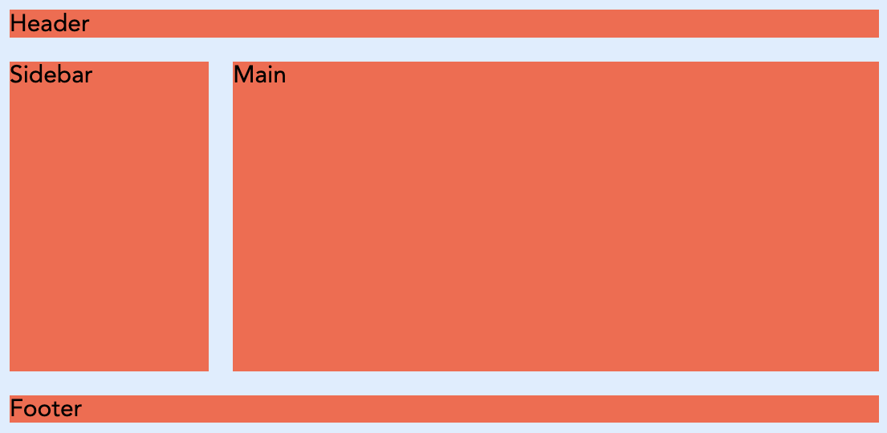

# Layouts com Flexbox e Gridbox em CSS

Até agora, vimos como estilizar elementos individualmente. Mas como organizamos esses elementos numa página? Antigamente, os designers usavam `float`, `position` e `table` para criar layouts, muitas vezes com resultados imprevisíveis e pouco flexíveis.

- [Layouts com Flexbox e Gridbox em CSS](#layouts-com-flexbox-e-gridbox-em-css)
  - [Flexbox (Flexible Box Layout)](#flexbox-flexible-box-layout)
    - [Conceitos Fundamentais](#conceitos-fundamentais)
    - [Propriedades do Flex Container](#propriedades-do-flex-container)
    - [Propriedades dos Flex Items](#propriedades-dos-flex-items)
  - [Grid Layout](#grid-layout)
    - [Conceitos Fundamentais](#conceitos-fundamentais-1)
    - [Propriedades do Grid Container](#propriedades-do-grid-container)
    - [Propriedades dos Grid Items](#propriedades-dos-grid-items)
  - [Flexbox vs. Grid: Quando usar cada um?](#flexbox-vs-grid-quando-usar-cada-um)
  - [Exercício prático de Grid e Flexbox](#exercício-prático-de-grid-e-flexbox)


Felizmente, o CSS moderno oferece duas ferramentas poderosas para a criação de layouts complexos e responsivos: **Flexbox** e **Grid**.

## Flexbox (Flexible Box Layout)

O Flexbox é um modelo de layout unidimensional. Isto significa que ele organiza os elementos numa única direção: ou como uma linha (horizontal) ou como uma coluna (vertical). É ideal para alinhar itens dentro de um contentor, como botões numa barra de navegação, ou para distribuir espaço entre elementos de um componente.

### Conceitos Fundamentais

Para usar o Flexbox, precisa de dois componentes principais:

1.  **Flex Container**: O elemento pai que contém os itens. Ativa-se o Flexbox aplicando `display: flex;` a este elemento.
2.  **Flex Items**: Os elementos filhos diretos do *flex container*.

```html
<div class="flex-container">
  <div class="flex-item">1</div>
  <div class="flex-item">2</div>
  <div class="flex-item">3</div>
</div>
```

### Propriedades do Flex Container

Estas propriedades são aplicadas ao elemento pai (`.flex-container`).

-   `display: flex;`: Ativa o contexto de formatação flex.
-   `flex-direction`: Define a direção do eixo principal.
    -   `row` (padrão): Da esquerda para a direita.
    -   `row-reverse`: Da direita para a esquerda.
    -   `column`: De cima para baixo.
    -   `column-reverse`: De baixo para cima.
-   `justify-content`: Alinha os itens ao longo do eixo principal.
    -   `flex-start`: Agrupa os itens no início.
    -   `flex-end`: Agrupa os itens no fim.
    -   `center`: Centraliza os itens.
    -   `space-between`: Distribui os itens uniformemente, com o primeiro no início e o último no fim.
    -   `space-around`: Distribui os itens uniformemente com espaçamento igual à volta de cada um.
    -   `space-evenly`: Distribui os itens uniformemente, com espaçamento igual entre todos.
-   `align-items`: Alinha os itens ao longo do eixo transversal (o eixo perpendicular ao principal).
    -   `stretch` (padrão): Estica os itens para preencher o contentor.
    -   `flex-start`: Alinha os itens no início do eixo transversal.
    -   `flex-end`: Alinha os itens no fim do eixo transversal.
    -   `center`: Centraliza os itens no eixo transversal.
-   `flex-wrap`: Permite que os itens quebrem para a linha seguinte se não houver espaço.
    -   `nowrap` (padrão): Todos os itens ficam na mesma linha.
    -   `wrap`: Os itens quebram para linhas adicionais.
-   `gap`: Define o espaçamento entre os itens.

Se aplicarmos ao exemplo acima o seguinte CSS:

```css
.flex-container {
	background: #def;
	display: flex;
	justify-content: space-evenly;
}
.flex-item {
	padding: 1rem;
	background-color: tomato;
}
```

obteremos três itens distribuídos uniformemente ao longo do contentor, com um fundo azul claro para o contentor e um fundo vermelho para os itens.


### Propriedades dos Flex Items

Estas propriedades são aplicadas aos elementos filhos (`.flex-item`).

-   `flex-grow`: Define a capacidade de um item crescer se houver espaço extra. Um valor de `1` significa que ele ocupará o espaço disponível de forma proporcional.
-   `flex-shrink`: Define a capacidade de um item encolher se não houver espaço suficiente.
-   `flex-basis`: Define o tamanho inicial de um item antes que o espaço restante seja distribuído.
-   `flex`: É um atalho para `flex-grow`, `flex-shrink` e `flex-basis`. Ex: `flex: 0 1 auto;`.
-   `order`: Altera a ordem visual dos itens, sem alterar o HTML. O valor padrão é `0`.
-   `align-self`: Permite que um item individual anule o `align-items` do contentor.

## Grid Layout

O Grid é um modelo de layout bidimensional. Ele permite organizar conteúdo em linhas e colunas simultaneamente, como uma tabela ou uma grelha. É perfeito para o layout geral da página, como cabeçalhos, barras laterais, conteúdo principal e rodapés.

### Conceitos Fundamentais

Assim como o Flexbox, o Grid tem um **Grid Container** e **Grid Items**.

1.  **Grid Container**: O elemento pai, ativado com `display: grid;`.
2.  **Grid Items**: Os filhos diretos do *grid container*.

```html
<div class="grid-container">
  <header class="grid-item">Header</header>
  <nav    class="grid-item">Sidebar</nav>
  <main   class="grid-item">Main</main>
  <footer class="grid-item">Footer</footer>
</div>
```

### Propriedades do Grid Container

-   `display: grid;`: Ativa o contexto de formatação grid.
-   `grid-template-columns`: Define o número e o tamanho das colunas da grelha.
    -   Ex: `grid-template-columns: 100px 1fr 2fr;` (três colunas, a primeira com 100px, a segunda com uma fração do espaço e a terceira com duas frações).
    -   A unidade `fr` (fração) é muito útil para distribuir o espaço restante.
-   `grid-template-rows`: Define o número e o tamanho das linhas.
-   `grid-gap` (ou `gap`): Define o espaçamento entre as linhas e colunas.
    -   `gap: 20px;` (espaçamento de 20px para linhas e colunas).
    -   `row-gap: 10px;`
    -   `column-gap: 15px;`
-   `grid-template-areas`: Permite nomear áreas da grelha para posicionar itens de forma mais semântica.

```css
.grid-container {
	background: #def;
	height: 100vh;
	display: grid;
	grid-template-columns: 1fr 3fr;
	grid-template-rows: auto 1fr auto;
	grid-template-areas:
		"header header"
		"sidebar main"
		"footer footer";
}
.grid-item {
	background: tomato;
	margin: 0.5rem;
}
div.grid-container header {
	grid-area: header;
}
div.grid-container nav {
	grid-area: sidebar;
}
div.grid-container main {
	grid-area: main;
}
div.grid-container footer {
	grid-area: footer;
}
```



### Propriedades dos Grid Items

-   `grid-column-start` / `grid-column-end`: Define em que linha de grelha a coluna do item começa e termina.
-   `grid-row-start` / `grid-row-end`: Define em que linha de grelha a linha do item começa e termina.
-   `grid-column`: Atalho para `grid-column-start` / `grid-column-end`. Ex: `grid-column: 1 / 3;` (ocupa da linha 1 à 3).
-   `grid-row`: Atalho para `grid-row-start` / `grid-row-end`.
-   `grid-area`: Associa um item a uma área nomeada em `grid-template-areas`.

```css
.header-item {
  grid-area: header;
}
.sidebar-item {
  grid-area: sidebar;
}
```

## Flexbox vs. Grid: Quando usar cada um?

A regra geral é:

-   **Flexbox para componentes e alinhamento unidimensional**: Use-o para barras de navegação, listas de cartões, ou qualquer coisa que precise ser alinhada numa única direção (linha ou coluna).
-   **Grid para o layout geral da página e alinhamento bidimensional**: Use-o para a estrutura principal da sua página, onde precisa de controlar tanto as colunas como as linhas.

A melhor parte é que eles podem ser usados em conjunto. É comum ter um layout de página feito com Grid, e dentro de uma das áreas da grelha, usar Flexbox para alinhar os itens de um componente.

## Exercício prático de Grid e Flexbox

Para praticar o que aprendeu, crie um layout simples de página usando Grid para a estrutura principal e Flexbox para alinhar os itens dentro de uma barra de navegação. Tente incluir:

- Um cabeçalho com o título do site.
- Uma barra de navegação com links.
- Um conteúdo principal com dois artigos lado a lado.
- Um rodapé com informações de copyright.
- Use Flexbox para alinhar os links da barra de navegação horizontalmente e Grid para organizar o cabeçalho, a barra de navegação, o conteúdo principal e o rodapé.