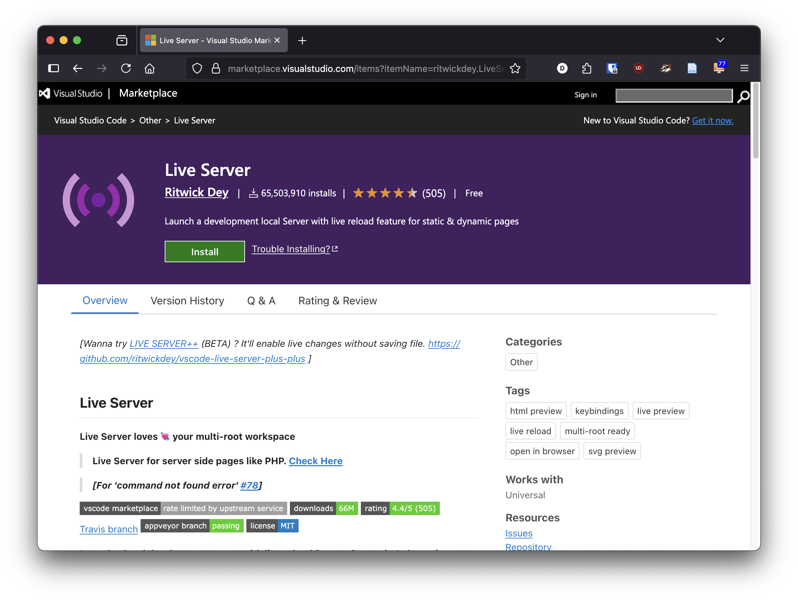

# Ferramentas e Ambientes de Desenvolvimento

- [Ferramentas e Ambientes de Desenvolvimento](#ferramentas-e-ambientes-de-desenvolvimento)
  - [Editores de Código](#editores-de-código)
  - [Browser Moderno](#browser-moderno)
    - [Browser Mobile](#browser-mobile)
  - [Ferramentas de Desenvolvimento (DevTools)](#ferramentas-de-desenvolvimento-devtools)
  - [Servidor Web Local](#servidor-web-local)
  - [Gestão de Versões com Git e GitHub](#gestão-de-versões-com-git-e-github)
    - [O que é Git?](#o-que-é-git)
    - [O que é GitHub?](#o-que-é-github)
    - [Benefícios de um Sistema de controlo de Versão](#benefícios-de-um-sistema-de-controlo-de-versão)
    - [Diferenças Entre Trabalho Local e Controlo de Versão](#diferenças-entre-trabalho-local-e-controlo-de-versão)
    - [Exemplo: Um Projeto de Design](#exemplo-um-projeto-de-design)
    - [Github pages](#github-pages)
    - [Fluxo de trabalho Básico do Git](#fluxo-de-trabalho-básico-do-git)
    - [Comandos git para tarefas comuns](#comandos-git-para-tarefas-comuns)
    - [Criar um repositório](#criar-um-repositório)
    - [Ver o estado do repositório](#ver-o-estado-do-repositório)
    - [Estados possíveis de um ficheiro](#estados-possíveis-de-um-ficheiro)
    - [Fazer alterações](#fazer-alterações)
    - [Utilizando o Github Desktop](#utilizando-o-github-desktop)
    - [Github Desktop](#github-desktop)
    - [Exercício para explorar o Git e o GitHub](#exercício-para-explorar-o-git-e-o-github)
  - [Referências úteis](#referências-úteis)

Neste capítulo, vamos explorar as ferramentas e ambientes de desenvolvimento mais comuns usados na criação de websites. Estas ferramentas ajudam os autores a escrever, testar e depurar o código de forma eficiente e rápida. Uma boa configuração de ambiente é essencial para o sucesso de qualquer projeto web.

## Editores de Código

Os editores de código são ferramentas essenciais para escrever e editar código-fonte. Alguns dos editores mais populares incluem:

- **[Visual Studio Code](https://code.visualstudio.com/)**: Um editor leve e extensível com suporte a várias linguagens de programação.
- **[Sublime Text](https://www.sublimetext.com/)**: Um editor rápido e poderoso com uma interface minimalista.
- **[Notepad](https://notepad-plus-plus.org/)++**: Um editor simples e eficaz para Windows.
- ... outros editors de código como Atom, Brackets, etc.

> A recomendação é usar o **Visual Studio Code**, pois é amplamente adotado e possui uma vasta gama de extensões que facilitam o desenvolvimento web. Embora os exemplos apresentados neste curso sejam feitos no Visual Studio Code, os conceitos são aplicáveis a qualquer editor de código.

## Browser Moderno

É importante usar um browser moderno para testar e depurar websites. Os browsers mais comuns incluem:

- **[Google Chrome](https://www.google.com/chrome/)**: Um dos browsers mais populares, com excelentes ferramentas de desenvolvimento integradas.
- **[Mozilla Firefox](https://www.mozilla.org/firefox/)**: Outro browser popular, conhecido por sua privacidade e extensões.
- **[Microsoft Edge](https://www.microsoft.com/edge)**: O browser padrão do Windows, baseado no Chromium.
- **[Safari](https://www.apple.com/safari/)**: O browser padrão do macOS e iOS, com bom suporte a padrões web.

> A recomendação é usar o **Google Chrome** ou o **Mozilla Firefox**, pois ambos possuem ferramentas de desenvolvimento robustas que facilitam a depuração e o teste de websites.

### Browser Mobile

Para testar a responsividade e o comportamento de websites em dispositivos móveis, é importante também usar um browser móvel. Os browsers móveis mais comuns incluem:

- **[Google Chrome para Android](https://play.google.com/store/apps/details?id=com.android.chrome)**: Versão móvel do Chrome, com suporte a ferramentas de desenvolvimento.
- **[Mozilla Firefox para Android](https://play.google.com/store/apps/details?id=org.mozilla.firefox)**: Versão móvel do Firefox, com suporte a extensões e ferramentas de desenvolvimento.
- **[Safari para iOS](https://www.apple.com/safari/)**: O browser padrão do iOS, com suporte a ferramentas de desenvolvimento.
- **[Microsoft Edge para Android](https://play.google.com/store/apps/details?id=com.microsoft.emmx)**: Versão móvel do Edge, com suporte a sincronização e ferramentas de desenvolvimento.

## Ferramentas de Desenvolvimento (DevTools)


É importante também instalar as **Ferramentas de Desenvolvimento** (DevTools) do browser, que permitem inspecionar o código HTML, CSS e JavaScript, depurar erros e otimizar o desempenho do site. Estas ferramentas estão disponíveis em todos os browsers modernos.

Para abrir as DevTools, geralmente pode-se usar a tecla `F12` ou clicar com o botão direito do mouse na página e selecionar “Inspecionar” ou “Inspecionar Elemento”.

No caso do Safari é necessário ativar as ferramentas de desenvolvimento nas preferências do browser. Vá a “Preferências” > “Avançado” e marque a opção “Mostrar menu Develop na barra de menus” ou “Show features for web developers”. Depois disso, você pode aceder as DevTools através do menu “Develop”.

## Servidor Web Local

Para testar websites localmente, é útil configurar um servidor web local. Isso permite simular o ambiente de produção e testar recursos como requisições HTTP, APIs e interações com o servidor.



A melhor forma de correr um servidor web local para testar o seu website é usar o **[Live Server](https://marketplace.visualstudio.com/items?itemName=ritwickdey.LiveServer)**, uma extensão do Visual Studio Code que permite iniciar um servidor local com um clique.

Para instalar, basta procurar por “Live Server” na loja de extensões do Visual Studio Code e clicar em “Instalar”. Depois de instalado, pode iniciar o servidor clicando com o botão direito do rato no ficheiro HTML e selecionando “Open with Live Server”.

## Gestão de Versões com Git e GitHub

A gestão de versões é uma prática essencial no desenvolvimento de software, permitindo registar alterações no código, colaborar com outros programadores e reverter mudanças quando necessário.

O Git é o sistema de controle de versão mais popular, e o GitHub é uma plataforma que hospeda repositórios Git e facilita a colaboração entre parceiros de um projeto.

Para além disso o GitHub oferece funcionalidades grátis como alojamento da página web do projeto, através do [GitHub Pages](https://pages.github.com/), que permite publicar sites estáticos diretamente de um repositório GitHub.

A forma mais fácil de começar a usar o Git e o GitHub é através do **[GitHub Desktop](https://desktop.github.com/)**, uma aplicação que permite gerir repositórios Git de forma gráfica e intuitiva.

> Mas há uma diferença entre o Git e o GitHub:

### O que é Git?

- O [Git](https://git-scm.com/) é um dos sistemas de controlo de versão mais populares:
  - **Distribuído**: Cada colaborador tem uma cópia completa do repositório.
  - **Rápido**: Opera localmente, o que significa que muitas operações não dependem da internet.
  - **Flexível**: Suporta workflows variados para diferentes tipos de projeto.

### O que é GitHub?

- O [GitHub](https://github.com/) é uma plataforma online que utiliza Git para guardar repositórios.
- Tem funcionalidades como:
  - **Interface Gráfica**: Mais amigável para iniciantes.
  - **Colaboração**: Ferramentas para revisão de código, issues e pull requests.
  - **Portfólio**: Hospedar projetos publicamente ou privadamente.

### Benefícios de um Sistema de controlo de Versão

1. **Histórico de Versões**
   - Aceder a versões antigas de arquivos.
   - Saber o que mudou, quando mudou e quem fez a alteração.
2. **Colaboração em Equipa**
   - Permite que múltiplas pessoas trabalhem no mesmo projeto sem sobrescrever o trabalho uns dos outros.
3. **Backup Seguro**
   - Como o código está armazenado num repositório, há backup garantido.

### Diferenças Entre Trabalho Local e Controlo de Versão

| **Trabalho Local (Sem VCS)** | **Com Controlo de Versão** |
|------------------------------|-----------------------------|
| Arquivos duplicados ("final", "final-final", "v2", etc.) | Um único repositório gerencia tudo |
| Difícil de acompanhar alterações | Histórico detalhado de modificações |
| Colaboração manual (e-mails, drives) | Colaboração simplificada em tempo real |

### Exemplo: Um Projeto de Design

- Imagine que está a criar uma página web para um cliente.
- Com um VCS:
  - Pode guardar a evolução do logotipo sem criar múltiplos arquivos.
  - Pode compartilhar com colegas, receber feedback e integrar alterações facilmente.
  - Pode rastrear o trabalho realizado e manter um histórico de alterações.
  - Pode colaborar com outros designers e programadores de forma eficiente.

### Github pages


### Fluxo de trabalho Básico do Git

1. **Clonar ou Inicializar um Repositório**
2. **Fazer Alterações Locais**
3. **Guardar Alterações** (Commit)
4. **Sincronizar com o Repositório Remoto** (Push e Pull)
5. **Rever e Integrar Trabalhos em Equipa** (Merge e Pull Requests)

### Comandos git para tarefas comuns

{height=8cm}

### Criar um repositório

criar um repositório vazio:

```sh
git init [nome do projeto]
```

clonar um repositório remoto

```sh
git clone URL_DO_REPO
```

### Ver o estado do repositório

listar as alterações

```sh
git status
```

listar o registo total

```sh
git log
```

listar diferenças

```sh
git diff
```

### Estados possíveis de um ficheiro

Os nossos ficheiros podem estar num de 3 estados

1. **modificado**: quando acabamos de fazer uma alteração e gravamos o ficheiro.
2. **preparado**: quando marcamos o ficheiro para ser submetido ao histórico do repositório [em lingo do git diz-se `staged`]
3. **confirmado**: quando se registam os ficheiros `staged` no repositório [no lingo do git diz-se `commited`]

### Fazer alterações

Marcar como **preparado** um ficheiro para ser adicionado ao repositório:

```sh
git add [ficheiro]
```

marcar [stage] todos os ficheiros como preparados

```sh
git add .
```

submeter ficheiros preparados [commit]

```sh
git commit -m "mensagem descritiva das alterações"
```

unstage (voltar ao estado modificado)

```sh
git reset [ficheiro]
```

unstage e perder alterações

```sh
git reset --hard
```

### Utilizando o Github Desktop

Em alternativa à utilização do `git` diretamente no terminal, é possível utilizar a aplicação [Github Desktop](https://github.com/) que permite realizar a maioria das tarefas do `git` e que permite integrar facilmente a conta do github.com

### Github Desktop


### Exercício para explorar o Git e o GitHub

Vamos criar um repositório no Github e criar uma pequena página pessoal de entrada.

1. Criar uma conta no Github.
2. Criar um repositório novo e dar-lhe um nome.
3. Criar um ficheiro chamado index.html no repositório e editar com "Olá Mundo".
4. Fazer commit
5. Nos settings ir à secção Github Pages e escolher o main branch
6. Abrir o browser em http://[username].github.io/[nome_do_repositorio]
7. Utilizar o [Github Desktop](https://github.com/apps/desktop) para fazer um repositório clone local no vosso computador
8. Fazer alterações ao ficheiro no repositório local.
9. Fazer `commit` e `push` e ver as alterações no repositório online.

## Referências úteis

- <https://git-scm.com/>
- <https://github.com/>
- <https://github.com/apps/desktop>
- <https://pages.github.com/>
- <https://marklodato.github.io/visual-git-guide/index-en.html>
