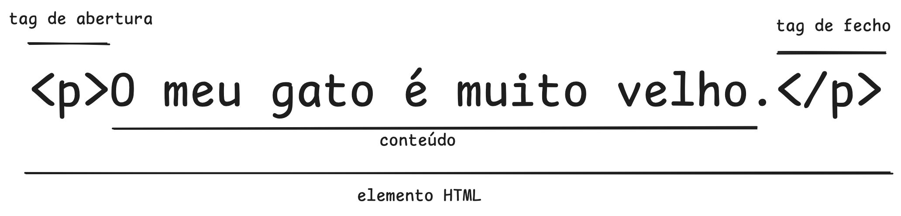

# Introdução ao HTML

- [Introdução ao HTML](#introdução-ao-html)
    - [Anatomia de um Elemento HTML](#anatomia-de-um-elemento-html)
    - [Sugestão de Exercício](#sugestão-de-exercício)
    - [Encapsulamento de elementos HTML](#encapsulamento-de-elementos-html)
    - [Elementos HTML só com TAGs de abertura ou elementos vazios](#elementos-html-só-com-tags-de-abertura-ou-elementos-vazios)
    - [Atributos](#atributos)
    - [Exercício](#exercício)
    - [Atributos booleanos](#atributos-booleanos)
    - [Aspas, Plicas ou nenhum dos dois?](#aspas-plicas-ou-nenhum-dos-dois)

O HTML (HyperText Markup Language) é a tecnologia que define o conteúdo e estrutura de uma página web. Quando bem escrita também define a semântica dos conteúdos numa forma estruturada e inteligivel por computadores, tornando as páginas acessíveis a pessoas com necessidades especiais, e melhorando a sua classificação para aparecer em resultados de motores de busca (SEO). Neste capítulo vamos começar por falar das estruturas principais de um documento HTML.

O HTML é constituído por uma sequência de elementos que são utilizados para circunscrever (marcar) os conteúdos que pretendemos incluir na página.

Por exemplo considere a seguinte frase:

```txt
O meu gato é muito velho.
```

Se quisermos dar-lhe o destaque de ficar num parágrafo, em HTML devemos colocá-lo dentro de um elemento `<p>`.

```html
<p>O meu gato é muito velho.</p>
```

Este HTML normalmente reside em documentos HTML, que possuem a extensão `.html`. Os conteúdos do ficheiro são editáveis com um editor de texto e normalmente o nome do ficheiro de entrada de um website é o `index.html`. 

> **NOTA**: Em HTML as Tags são **case-insensitive**. Isto significa que tanto `<p>` como `<P>` são perfeitamente equivalentes, mas recomenda-se a adoptar um estilo coerente (todas minusculas ou todas maiusculas)

### Anatomia de um Elemento HTML

```html
<p>O meu gato é muito velho.</p>
```

No exemplo acima podemos ver que o elemento HTML é constituído por diversas partes:



1. Uma tag de abertura de elemento HTML `<p>`
2. O conteúdo do elemento HTML
3. Uma tag de fecho do elemento HTML `</p>`. As tags de fecho são iguais às Tags de abertura exceto que possuem o `/` para indicar tratarem-se de fecho de tag. 

### Sugestão de Exercício

> No [playground online da
> Mozilla](https://developer.mozilla.org/en-US/play) pode experimentar
> os pequenos exercícios propostos.

Experimente copiar o elemento HTML anterior para a caixa de HTML do playground e faça run.

Experimente utilizar o elemento `<strong>` para circunscrever a palavra gato. O elemento `<strong>` modifica a palavra gato para ficar a **negrito (bold)**.

Experimente também o elemento `<em>` (enfase), resultando num texto _itálico_.

### Encapsulamento de elementos HTML

Os elementos podem ser colocados dentro de outros elementos. No caso anterior podemos encasular `<strong>` dentro do `<p>`:

```html
<p>O meu <strong>gato</strong> é muito velho.</p>
```

é no entanto importante ter em atenção que o seguinte exemplo está errado:

```html
<p>O meu <strong>gato é muito velho.</p></strong>
```

porque o encapsulamento do elemento `<strong>` não está dentro do `<p>`. A tag de fecho aparece fora do elemento pai. Todos os elementos HTML devem estar contidos dentro de outros elementos e a não observação desta regra pode levar a resultados inesperados.

Os browsers na presença destes erros, tentam renderizar a página e não _crasham_ como acontece com um programa de computador. Isto deve-se a razões históricas. Os browsers sempre tentam renderizar os conteúdos HTML, aplicando alguns padrões. No entanto cada browser é livre de interpretar estes erros de forma livre pelo que é importante ter particular atenção aos possíveis erros para evitar efeitos iprevisiveis.

### Elementos HTML só com TAGs de abertura ou elementos vazios

Nem todos os elementos HTML seguem o padrão `<tag de abertura>conteúdo</tag de fecho>`. Alguns elementos consistem apenas numa única tag. São normalmente elementos que são utilizados para inserir algum elemento multimedia no documento. Um exemplo destes elementos é o elemento `` utilizado para inserir imagens no documento HTML.

```html

```

Neste exemplo a tag `` tem no seu interior (entre o `<` e o`>`) duas propriedades extras: a propriedade `src="logo.png"` define qual o nome do ficheiro de imagem a mostrar, e a propriedade `alt="Logotipo da Empresa"` descreve a imagem para o caso de a imagem não poder ser lida, ou para o caso em que o utilizador esteja a utilizar um sistema de acessibilidade.

> **NOTA**: Nos elementos HTML como o `` em que não há tag de fecho pode ser utilizada uma `/` de fecho antes do `>` final. por exemplo ``

### Atributos

Os elementos HTMl também podem ter atributos. Por exemplo:

```html
<p class="nota-pessoal">O meu gato é muito velho.</p>
```

Neste exemplo o elemento `<p>` tem um atributo `class="nota-pessoal"` que define a class deste elemento. Classes são uma forma de classificar elementos para posteriormente serem estilizados utilizando CSS.

Os atributos são colocados nas tags de abertura e devem ter o nome do atributo, seguido de um igual e de valor do atributo, normalmente entre aspas (`"`) ou plicas (`'`).

> **NOTA**: Não são permitidas aspas ou plicas tipográficas “ ” ou ‘ ’

### Exercício

No [playground online da Mozilla](https://developer.mozilla.org/en-US/play) copie o seguinte código:

```html

```

Nesta imagem coloque os seguintes atributos:

- `src` com o ficheiro localizado no endereço `https://picsum.photos/200` (para além de nomes de ficheiros também é possivel utilizar URLs de imagens que estejam já publicadas online)
- `alt` uma descrição da imagem
- `width` defina uma largura para a imagem (em pixels)
- `height` defina uma altura para a imagem (em pixels)

Um resultado poderá ser:

```html

```

Para acomodar melhor os atributos do elemento HTML é possível colocá-los em multiplas linhas para facilitar a leitura:

```html

```

No entanto convém sempre ter atenção à legibilidade dos elementos no contexto da página html que estamos a escrever.

### Atributos booleanos

Por vezes vai encontrar atributos sem a atribuição de um valor. Estes atributos são booleanos. Atributos booleanos são atributos que são _verdadeiros_ (existem) ou _falsos_ (não existem). Por exemplo, o atributo `disabled` que informa o browser que o elemento de entrada de texto `input` está “desligado”, pode ser escrito das duas formas seguintes:

```html
<input type="text" disabled="disabled" />
```

em que o atributo **disabled** é definido com a atribuição da string com o próprio nome do atributo “disabled” ou simplesmente

```html
<input type="text" disabled />
```

em que apenas se coloca o nome do atributo que se quer ativar.

> **CURIOSIDADE** Booleano vem do nome de [George Boole](https://pt.wikipedia.org/wiki/George_Boole), um matemático do século XIX inventor da algebra booleana. 

### Aspas, Plicas ou nenhum dos dois?

Por vezes podem-se encontrar páginas web com código ligeiramente diferente daquele especificado no standard. Uma das alterações que poderá encontrar diz respeito à não utilização de aspas ou plicas. Por exemplo uma ancora `<a>` para fazer uma hiperligação a outra página pode aparecer sem aspas no atributo `href`: 

```html
<a href=http://www.example.com/>Website de Exemplo</a>
```

Embora funcione no caso do URL, uma vez que o URL não contém espaços, se começarmos a adicionar outros atributos como o `title`[^tit]

```html
<a href=http://www.example.com/ title=Website para exemplo>
  Website de Exemplo
</a>
```

Se testarmos este código no playground verificamos que ao parar o rato em cima do link o título que aparece não é correto aparecendo apenas “Website” sendo o resto do título truncado.

> **RECOMENDAÇÃO**: Utilize sempre aspas `"` ou plicas `'` para definir os atributos.

Quanto à utilização de aspas `"` ou plicas `'`, a escolha é indiferente e normalmente uma escolha de estilo pessoal ou das definições da equipa com que está a trabalhar. 

Também não é possível delimitar um atributo misturando aspas e plicas. Por exemplo `"Página pessoal'` é errado e não vai ser aceite pelo browser dando resultados inesperados porque mistura os dois tipos de delimitadores.

Acima de tudo recomenda-se consistência. O exemplo anterior deveria ser escrito numa das duas seguintes formas:

```html
<a href="http://www.example.com/" title="Website para exemplo">
  Website de Exemplo
</a>

<a href='http://www.example.com/' title='Website para exemplo'>
  Website de Exemplo
</a>
```

Quando se utiliza um tipo (aspas ou plicas), pode-se utilizar o outro tipo dentro do texto. Isto implica que se utilizar aspas como delimitador é possível usar a plica como conteúdo (útil para lingua inglesa para contrações como _I'm_, ou _can't_). Por exemplo:

```html
<a 
  href="http://www.example.com/" 
  title="I can't really see any content in this website">
    Website de Exemplo
</a>
```

[^tit]: o `title` aparece quando se para o rato sobre a hiperligação

Até agora aprendemos alguns aspetos dos elementos HTML. Está na altura de introduzir a estrutura do documento HTML na secção seguinte, onde vamos combinar os diferentes elementos para criar uma página HTML.
